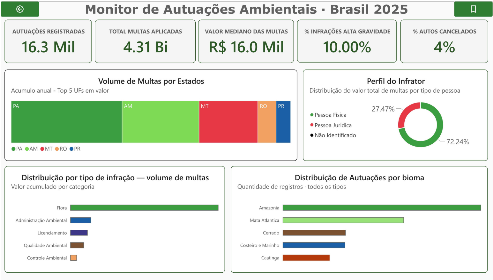

# 🌿 Monitor de Autuações Ambientais · Brasil 2025
 

  > Painel de inteligência ambiental construído sobre os dados públicos do IBAMA — análise de **16.262 autuações de impacto ambiental direto**, **R$ 4,31 bilhões em multas** aplicadas em 2025, distribuídas por bioma, estado e perfil do infrator.
  ---

## 🎯 Objetivos
- Centralizar informações sobre autos de infração ambiental.  
- Identificar padrões regionais e temáticos de multas.  
- Apoiar políticas públicas e estratégias de fiscalização.  
- Comunicar dados complexos de forma acessível e visualmente atraente.

---

## 📊 Principais KPIs

---

## 🔎 Visualizações-Chave

### 1. Volume de Multas por Estados
Ranking dos 5 estados com maior valor acumulado de multas.  
Permite identificar regiões críticas de fiscalização.  

## 📌 Insights
 
O gráfico de Volume de Multas por Estados mostra concentração extrema no Norte:
 
| # | Estado | Total de Multas | % do total |
|---|--------|----------------|-----------|
| 🥇 | **PA** — Pará | R$ 1,09 Bi | 29,1% |
| 🥈 | **AM** — Amazonas | R$ 826 Mi | 22,1% |
| 🥉 | **MT** — Mato Grosso | R$ 526 Mi | 14,1% |
| 4º | RO — Rondônia | R$ 174 Mi | 4,7% |
| 5º | PR — Paraná | R$ 145 Mi | 3,9% |
 
PA + AM + MT somam **R$ 2,44 bilhões** — 65,3% de todo o valor da base analítica. O Pará sozinho responde por quase 1 em cada 3 reais de multa ambiental aplicada no Brasil em 2025.
 
---

### 2. Perfil do Infrator
Distribuição entre pessoa física, pessoa jurídica e não identificado.  
Mostra quem concentra maior responsabilidade nas infrações.  

## 📌 Insights
 
O donut de Perfil do Infrator mostra que a destruição ambiental no Brasil não é fenômeno exclusivamente corporativo:
 
| Perfil | % das autuações |
|--------|----------------|
| **Pessoa Física** | **75,41%** |
| Pessoa Jurídica | 23,01% |
| Não Identificado | 0,32% (107 registros sem CPF/CNPJ) |
 
Três quartos dos infratores são **indivíduos** — pequenos produtores, posseiros, garimpeiros e caçadores. O ticket médio de PF (R$ 274 mil) é comparável ao de PJ (R$ 252 mil), indicando que o porte da multa independe da natureza jurídica do infrator.
 
---

### 3. Distribuição por Tipo de Infração
 
Evidencia quais áreas concentram maior valor de multas.  

## 📌 Insights
 
O gráfico de distribuição por tipo de infração revela que **Flora é o tipo dominante** em volume e valor:
 
| Tipo | Autos | Total Multas | % do valor |
|------|-------|-------------|-----------|
| **Flora** | 6.807 | **R$ 2,84 Bi** | **75,9%** |
| Adm. Ambiental | 1.900 | R$ 396 Mi | 10,6% |
| Qualidade Ambiental | 1.804 | R$ 259 Mi | 6,9% |
| Fauna | 2.321 | R$ 124 Mi | 3,3% |
| Pesca | 1.414 | R$ 118 Mi | 3,2% |
 
Infrações de Flora, desmatamento e supressão vegetal ilegal concentram **mais de 3/4 de todo o valor** aplicado na base analítica. Cada auto do tipo Flora vale em média R$ 418 mil, contra R$ 84 mil em Pesca e R$ 53 mil em Fauna.

Dados complementares:
 
| Tipo excluído | Autos | Valor | Motivo da exclusão |
|---------------|-------|-------|--------------------|
| Cadastro Técnico Federal | 589 | R$ 5,7 Mi | Obrigação cadastral, sem dano ambiental direto |
| Controle Ambiental | 546 | R$ 123,8 Mi | Categoria administrativa, não de destruição ambiental |
| Licenciamento | 460 | R$ 330,9 Mi | Infração documental — analisada separadamente |
| Outras | 322 | R$ 92,0 Mi | Categoria genérica sem classificação específica |
| Org. Gen. Modific. e Biopirataria | 72 | R$ 7,7 Mi | Volume reduzido, nicho específico |
| Unidade de Conservação | 15 | R$ 11,0 Mi | Sobreposição com Flora |
| Ord. Urbano e Patr. Cultural | 12 | R$ 282 mil | Fora do escopo ambiental-ecológico |
| **Base analítica** | **16.262** | **R$ 4,31 Bi** | |
---

### 4. Distribuição por Bioma
 
Reforça a vulnerabilidade dos principais ecossistemas brasileiros.  

## 📌 Insights 
 
O gráfico de Distribuição por Bioma exibe a quantidade de autuações por ecossistema:
 
| Bioma | Autuações | % do total |
|-------|-----------|-----------|
| **Amazônia** | 5.950 | **41,8%** |
| Mata Atlântica | 3.256 | 22,9% |
| Costeiro e Marinho | 1.801 | 12,6% |
| Cerrado | 1.563 | 11,0% |
| Caatinga | 1.313 | 9,2% |
| Pantanal | 53 | 0,4% |
 
A Amazônia lidera em volume com folga. Mas a **Mata Atlântica**, com menos de 12% do território original remanescente, ainda concentra **22,9% das autuações** o segundo bioma mais fiscalizado do país, evidenciando pressão intensa sobre um ecossistema já altamente degradado.

## 🚨 Insights das Infrações de Alta Gravidade 

O indicador `% Infrações Alta Gravidade` exibe **10,00%** — proporção de autos com nível D ou E sobre a base analítica:

| Nível | Registros | Multa Média |
|-------|-----------|-------------|
| A (mais leve) | 3.455 | R$ 32 mil |
| B | 1.048 | R$ 152 mil |
| C | 971 | R$ 370 mil |
| D | 613 | R$ 530 mil |
| **E (mais grave)** | **821** | **R$ 707 mil** |
| Sem classificação | ~7.300 | R$ 306 mil |
 
- A multa média do nível E é **22 vezes maior** que a do nível A.  
- O dado mais crítico: **mais de 60% dos autos não têm gravidade classificada** e esse grupo sem classificação tem ticket médio de R$ 306 mil, acima dos níveis B e C, sugerindo que a ausência de classificação não implica menor severidade.

## ⚖️ Insight da Mediana da Multa
A mediana das multas em **R$ 16,0 mil** mostra que, apesar de existirem valores muito altos que elevam o total acumulado (R$ 4,31 bilhões), a maior parte das autuações se concentra em um patamar intermediário.  
  
- A distribuição é **desigual**, com poucas infrações gigantes puxando o total para cima.  
- A mediana é um **indicador mais realista** do que a média, pois evita distorções.  
- O perfil das infrações sugere **recorrência em porte médio**, como desmatamentos menores ou irregularidades em licenciamento, enquanto grandes empreendimentos aparecem em menor quantidade, mas com impacto financeiro elevado.  

📌 **Mensagem-chave:**  
> “A maioria das infrações ambientais no Brasil em 2025 resultou em multas de porte médio, em torno de R$ 16 mil, revelando que o problema é recorrente e pulverizado, mais do que concentrado em grandes casos isolados.”

## ❌ Insight dos Autos Cancelados
O percentual de **autos cancelados (4%)** indica que uma pequena fração das autuações não se manteve válida após análise ou recurso.  

- A **efetividade da fiscalização é alta**, já que a maioria dos autos permanece válida.  
- O cancelamento pode estar ligado a **erros formais, inconsistências documentais ou revisões administrativas**.  
- Esse indicador é importante para medir a **qualidade dos processos de autuação**, mostrando que há espaço para melhorar a precisão e reduzir retrabalho.  

📌 **Mensagem-chave:**  
> “Com apenas 4% de autos cancelados, o processo de fiscalização ambiental demonstra consistência, mas reforça a necessidade de aprimorar a qualidade técnica e documental para reduzir ainda mais perdas de efetividade.”

---

## 💡 Insights Estratégicos
- **Pressão Regional:** Estados da Amazônia Legal dominam o ranking, reforçando a necessidade de políticas específicas para a região.  
- **Infrações Críticas:** Flora e Licenciamento são os maiores focos de multas, revelando desafios no combate ao desmatamento e na regulação de empreendimentos.  
- **Biomas em Risco:** A Amazônia é o bioma mais autuado, mas outros ecossistemas também sofrem pressão significativa.  

---

## 🛠️ Tecnologias
- **Power BI Desktop**  
- **DAX** para cálculos avançados  
- **CSV/Excel** como fonte de dados  

---
## 🗃️ Como Baixar os Dados
 
**🔗 Fonte oficial:**
 
> **[Fiscalização: Auto de Infração](https://dadosabertos.ibama.gov.br/dataset/fiscalizacao-auto-de-infracao)**

## 📄 Licença
Este projeto é de caráter acadêmico e informativo.  
Uso livre para fins de estudo e análise.

---

## 👤 Autor

**Marcos Vinicius Lima**

*Analista de Dados · Power BI · DAX · Dados Ambientais*  
*Especialista em análise de dados e visualização aplicada à gestão ambiental*

